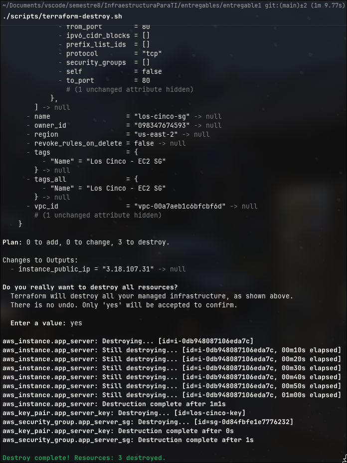
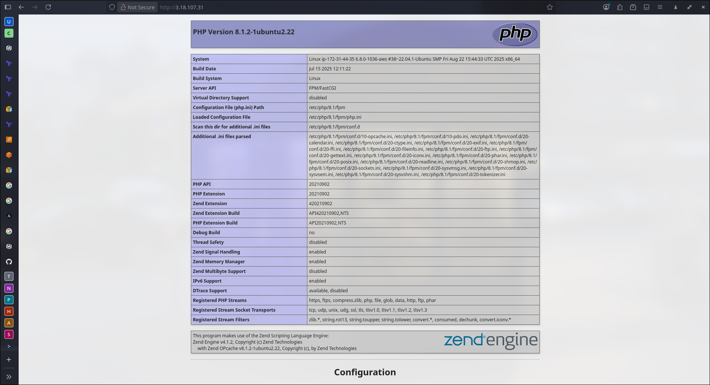

# Trabajo Grupal - Los Cinco - Infraestructura para TI - NRC: 1396

## Integrantes

Grupo: Los Cinco

| Código    | Nombre Completo                  |
| --------- | -------------------------------- |
| T00064084 | Paula Andrea Márquez Orlando     |
| T00067622 | Mauro Alonso Gonzalez Figueroa   |
| T00067699 | Juan Diego Perez Navarro         |
| T00068226 | Diederik Antonio Montaño Burbano |
| T00070568 | Omar David Barrios de Alba       |

Fecha: 23 de septiembre de 2025.

## Enunciado

Usar Terraform para aprovisionar una máquina virtual (Instancia EC2) con Ubuntu 22.04 LTS y usar Ansible para configurarla como servidor Nginx con PHP. Usar como base los ejemplos publicados en el curso para cada herramienta.

La máquina deberá ser accesible desde Internet a través de su dirección IP pública (tanto para administrarla como para el acceso web - puerto 80).

**Entregables:**

* Archivos de código fuente IaC de Terraform para el aprovisionamiento de la máquina.
* Archivos de código fuente de Ansible para la configuración de la máquina.
* Archivos de código fuente de la aplicación PHP de prueba (pueden estar en el mismo directorio que los demás).
* Sugiero tomar todo y comprimir en un único .ZIP y subir el archivo comprimido solamente.

## Resultado

Para poder realizar toda esta tarea, se procuró cumplir con los lineamientos establecidos en el enunciado: crear una instancia de Amazon EC2 (Elastic Compute Cloud) con Terraform, y configurar un servidor de PHP en Nginx con Ansible.

Para ello, se organizó la entrega de esta forma:

```bash
entregable1/
├── figures/
├── iac/
│   ├── ansible/
│   │   ├── ansible_vars.yaml
│   │   ├── inventory
│   │   └── nginx.yaml
│   └── terraform/
│       └── main.tf
├── keys/
├── scripts/
│   ├── ansible-nginx.sh
│   ├── generate-key.sh
│   ├── terraform-deploy.sh
│   └── terraform-destroy.sh
├── src/
│   ├── index.php
│   └── nginx.conf.j2
└── README.md
```

En [src](./src/) está el código fuente del servidor: la aplicación en PHP y el servidor en Nginx. Realmente, el contenido de la aplicación en PHP es irrelevante, puesto que lo único que interesa es que sea visible desde internet, nada más.

En [scripts](./scripts/) existen scripts escritos por nosotros, para poder utilizar de manera más fácil los comandos de Ansible y Terraform (para más información, ver [aquí](#scripts)). Aun así, es importante mencionar que, debido a cómo resolvimos el problema, para poder utilizar Terraform y Ansible, es necesario ejecutar el script [generate-key.sh](./scripts/generate-key.sh), para obtener un par de claves pública y privada utilizando el algoritmo RSA con 2048 bits. Este script debe ser ejecutado desde Bash, lo que no implica que deba ser propio de Linux, por tanto, en caso de usar Windows, se recomienda utilizar aplicaciones como Git Bash para ejecutar este script. Este par claves son luego guardadas en [keys](./keys/).

En [iac](./iac/) está el todo el código de la infraestructura en [Terraform](./iac/terraform/) y [Ansible](./iac/ansible/). Para más información de cada uno de estos, ver: [Terraform](#terraform) y [Ansible](#ansible).

### Scripts

Los scripts encontrados en [scripts/](./scripts/) son todos ejecutables, y deben ser ejecutados desde la raíz de este entregable, es decir, al mismo nivel que este README. Para ejecutarlos, se puede hacer como el siguiente ejemplo:

```bash
.../entregable1$./scripts/terraform-deploy.sh
```

Actualmente, los scripts existentes son:

* [ansible-nginx.sh](./scripts/ansible-nginx.sh). Configurar el servidor en NGINX de la aplicación en PHP.
* [generate-key](./scripts/generate-key.sh). Para generar el par de claves pública y privada utilizadas por Terraform y Ansible.
* [terraform-deploy](./scripts/terraform-deploy.sh). Se inicializa Terraform, valida el plan de ejecución, y en caso de todo estar correcto, se aplica.
* [terraform-destroy](./scripts/terraform-destroy.sh). Para destruir todos los recursos creados con Terraform.

### Terraform

En Terraform se creó una instancia de Amazon EC2, teniendo en cuenta los detalles acerca los grupos de seguridad, para permitir que se pueda recibir tráfico desde el internet, hacia la instancia por los puertos 22 (SSH) y 80 (HTTP). El puerto 80 fue habilitado, porque fue uno de los requerimientos del enunciado, pero el 22 también se habilitó para que en Ansible sea posible conectarse al servidor y poder realizar toda la instalación correspondiente, declarando la llave pública con la que se conectará. Por último, el tráfico saliente del servidor se habilitó hacia todo el internet.

### Ansible

Como Ansible se debe conectar al servidor, se necesita sí o sí, la IP de la instancia de EC2, y para evitar que se busque directamente desde la consola de AWS, siempre que se despliega la aplicación con Terraform, se muestra la IP pública que se debe especificar en el inventario ([inventory](./iac//ansible/inventory)): `ansible_host=<PUBLIC-IP-ADDRESS>`, `<PUBLIC-IP-ADDRESS>` es solamente un placeholder. Una vez se reemplaza la dirección de la IP pública del servidor, es posible utilizar Ansible sin mayor problemas.

---

### Evidencias

Para evitar cualquier tipo de malentendidos, hemos preferido mostrar con capturas de pantalla el funcionamiento de la aplicación, y así demostrar que sí funciona nuestra solución.

#### Generar clave


#### Funcionamiento Terraform

##### Deploy


##### Destroy



#### Funcionamiento Ansible


#### Funcionamiento Servidor Web


