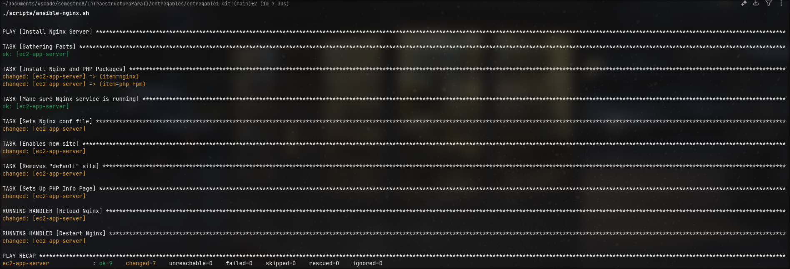

# Trabajo Grupal - Los Cinco - Infraestructura para TI - NRC: 1396

## Integrantes

Grupo: Los Cinco

| Código    | Nombre Completo                  |
| --------- | -------------------------------- |
| T00064084 | Paula Andrea Márquez Orlando     |
| T00067622 | Mauro Alonso Gonzalez Figueroa   |
| T00067699 | Juan Diego Perez Navarro         |
| T00068226 | Diederik Antonio Montaño Burbano |
| T00070568 | Omar David Barrios de Alba       |

Fecha: 23 de septiembre de 2025.

## Enunciado

Usar Terraform para aprovisionar una máquina virtual (Instancia EC2) con Ubuntu 22.04 LTS y usar Ansible para configurarla como servidor Nginx con PHP. Usar como base los ejemplos publicados en el curso para cada herramienta.

La máquina deberá ser accesible desde Internet a través de su dirección IP pública (tanto para administrarla como para el acceso web - puerto 80).

**Entregables:**

* Archivos de código fuente IaC de Terraform para el aprovisionamiento de la máquina.
* Archivos de código fuente de Ansible para la configuración de la máquina.
* Archivos de código fuente de la aplicación PHP de prueba (pueden estar en el mismo directorio que los demás).
* Sugiero tomar todo y comprimir en un único .ZIP y subir el archivo comprimido solamente.

---

## Resultado

Para realizar esta tarea, se cumplieron todos los lineamientos establecidos en el enunciado: crear una instancia de Amazon EC2 (Elastic Compute Cloud) con Terraform y configurar un servidor PHP con Nginx utilizando Ansible.

La entrega se organizó de la siguiente manera:

```bash
entregable1/
├── figures/
├── iac/
│   ├── ansible/
│   │   ├── ansible_vars.yaml
│   │   ├── inventory
│   │   └── nginx.yaml
│   └── terraform/
│       └── main.tf
├── keys/
├── scripts/
│   ├── ansible-nginx.sh
│   ├── generate-key.sh
│   ├── terraform-deploy.sh
│   └── terraform-destroy.sh
├── src/
│   ├── index.php
│   └── nginx.conf.j2
└── README.md
```

En [src](./src/) se encuentra el código fuente del servidor: la aplicación PHP y la configuración de Nginx. El contenido de la aplicación PHP es básico, ya que el objetivo principal es demostrar que sea accesible desde internet.

En [scripts](./scripts/) se encuentran scripts creados para facilitar el uso de los comandos de Ansible y Terraform (para más información, consultar la sección [Scripts](#scripts)). Es importante mencionar que, debido a la implementación elegida, para poder utilizar Terraform y Ansible es necesario ejecutar primero el script [generate-key.sh](./scripts/generate-key.sh) para generar un par de claves pública y privada utilizando el algoritmo RSA de 2048 bits. Este script debe ejecutarse desde Bash (en Windows se recomienda usar Git Bash u otro emulador compatible). Las claves generadas se almacenan en el directorio [keys](./keys/).

En [iac](./iac/) se encuentra todo el código de infraestructura como código (IaC) organizado en [Terraform](./iac/terraform/) y [Ansible](./iac/ansible/). Para obtener información detallada de cada herramienta, consultar las secciones [Terraform](#terraform) y [Ansible](#ansible).

### Scripts

Los scripts ubicados en [scripts/](./scripts/) son todos ejecutables y deben ejecutarse desde el directorio raíz de este entregable (al mismo nivel que este README). Ejemplo de ejecución:

```bash
.../entregable1$./scripts/terraform-deploy.sh
```

Los scripts disponibles son:

* [generate-key.sh](./scripts/generate-key.sh): Genera el par de claves pública y privada utilizadas por Terraform y Ansible.
* [terraform-deploy.sh](./scripts/terraform-deploy.sh): Inicializa Terraform, valida el plan de ejecución y lo aplica si todo es correcto.
* [ansible-nginx.sh](./scripts/ansible-nginx.sh): Configura el servidor Nginx con la aplicación PHP.
* [terraform-destroy.sh](./scripts/terraform-destroy.sh): Destruye todos los recursos creados con Terraform.

### Terraform

Con Terraform se creó una instancia de Amazon EC2, configurando los grupos de seguridad necesarios para permitir tráfico desde internet hacia la instancia por los puertos 22 (SSH) y 80 (HTTP). El puerto 80 se habilitó como requerimiento del enunciado, mientras que el puerto 22 se habilitó para permitir que Ansible pueda conectarse al servidor y realizar la instalación correspondiente, declarando la clave pública que se utilizará para la conexión. Adicionalmente, se habilitó todo el tráfico saliente del servidor hacia internet.

### Ansible

Para que Ansible pueda conectarse al servidor, es indispensable conocer la dirección IP de la instancia EC2. Con el objetivo de evitar buscar esta información manualmente en la consola de AWS, cada vez que se despliega la infraestructura con Terraform, se muestra la IP pública que debe especificarse en el archivo de inventario ([inventory](./iac//ansible/inventory)) reemplazando el placeholder `<PUBLIC-IP-ADDRESS>` en la línea `ansible_host=<PUBLIC-IP-ADDRESS>`. Una vez actualizada la dirección IP pública del servidor, es posible utilizar Ansible sin inconvenientes.

---

### Evidencias

Para demostrar el correcto funcionamiento de la solución implementada, se incluyen capturas de pantalla que muestran cada etapa del proceso de despliegue y configuración.

#### Generación de claves


#### Funcionamiento de Terraform

##### Despliegue


##### Destrucción de recursos


#### Funcionamiento de Ansible



#### Funcionamiento del servidor web


