# TALLER PRÁCTICO DE DOCKER – DESPLIEGUE DE UNA APLICACIÓN WEB

TODO: Mejorar la redacción y explicar con detalle el Dockerfile

## Enunciado

**Objetivo:** Familiarizarse con los conceptos fundamentales de Docker y aprender a desplegar una aplicación web simple utilizando contenedores.

**Descripción:** En este taller, los estudiantes aprenderán a utilizar Docker para crear, ejecutar y gestionar contenedores. Utilizarán un Dockerfile con las instrucciones apropiadas para construir y desplegar una aplicación web basada en .NET Core 8.0 y explorarán cómo Docker puede simplificar el desarrollo y la implementación de aplicaciones.

**Ejercicio:**

  1. **Instalación de Docker:**
      * Usar cualquier sistema de virtualización (o la nube) para contar con una máquina virtual con sistema operativo Ubuntu Server versión 24.04 LTS

      * Instalar Docker en la máquina virtual antes creada. Para ello, revisar la siguiente documentación:
        1. [https://docs.docker.com/engine/install/ubuntu/](https://docs.docker.com/engine/install/ubuntu/)
        2. [https://docs.docker.com/engine/install/linux-postinstall/](https://docs.docker.com/engine/install/linux-postinstall/)

      * Verificar la instalación ejecutando el comando docker –version

  2. **Hello World con Docker:**
      * Ejecutar el contenedor “hello-world” para asegurarse de que Docker está instalado correctamente.  

  3. **Despliegue de una Aplicación Web:**
      * Crear una aplicación web con .NET 8.0 SDK (se debe instalar este framework en el servidor Linux). Para ello pueden ejecutar los siguientes comandos (solo es un ejemplo): `dotnet new web -n MyWebApp`

      * Crear un Dockerfile para que, usando el código fuente que se crea luego de la ejecución del comando anterior, se construya (compile) y se publique la aplicación en un contenedor. Microsoft cuenta con imágenes oficiales de Docker para usar como entornos de construcción (build) y como entornos de ejecución (runtime):
          * Para el proceso de Build se puede usar la imagen: `mcr.microsoft.com/dotnet/sdk:8.0`
          * Para el proceso de creación de la imagen final que solo requiere el runtime, se puede usar la imagen: `mcr.microsoft.com/dotnet/aspnet:8.0`

        Tener en cuenta que el puerto predeterminado en el cual se activa el servidor web de este contenedor es el puerto 8080. Por tal motivo, investigar como hacer para cambiar este comportamiento y que se pueda exponer el puerto 80 en lugar del predeterminado.

      * Ejecutar un contenedor con esta imagen y mapear el puerto del contenedor al puerto de la máquina host.

      * Acceder a la aplicación web desde un navegador para confirmar que el despliegue fue exitoso.
  
  4. **Compartir la Imagen:**
      * Subir la imagen personalizada a Docker Hub.
      * Ejecutar un contenedor en una máquina diferente utilizando la imagen subida a Docker Hub.

## Respuestas

### Instalación Docker

#### Create Virtual Machine

Como proveedor de la nube para crear la máquina virtual, se usó AWS, y se desplegaron instancias de Amazon EC2, utilizando Terraform y scripts hechos por nosotros para desplegar de manera más cómoda.

Archivo de terraform: [main.tf](./terraform/main.tf)
Scripts de bash: [scripts/](./scripts/). El archivo [terraform-deploy.sh](./scripts/terraform-deploy.sh) se inicializa terraform, se valida y se ejecuta todo el plan del archivo de terraform, para finalmente obtener como output la clave SSH para conectarse por SSH al servidor. Dicha llave (`los-cinco-key.pem`) se le cambian los permisos para que unicamente el Owner pueda leer y escribir (`chmod 600 los-cinco-key.pem`).

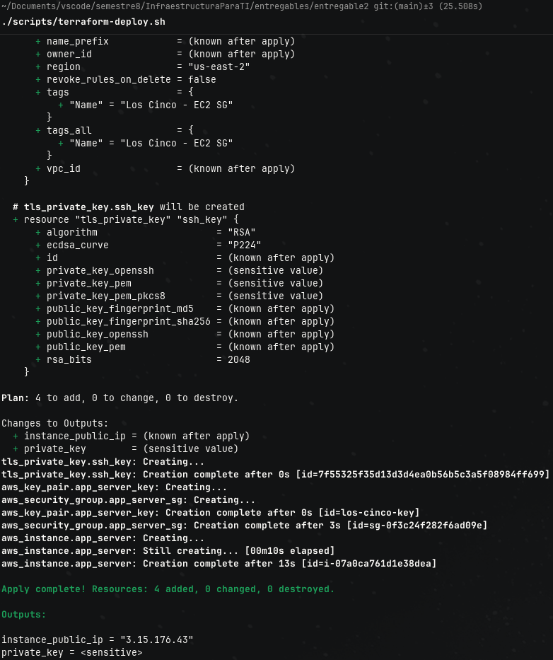

#### SSH connection

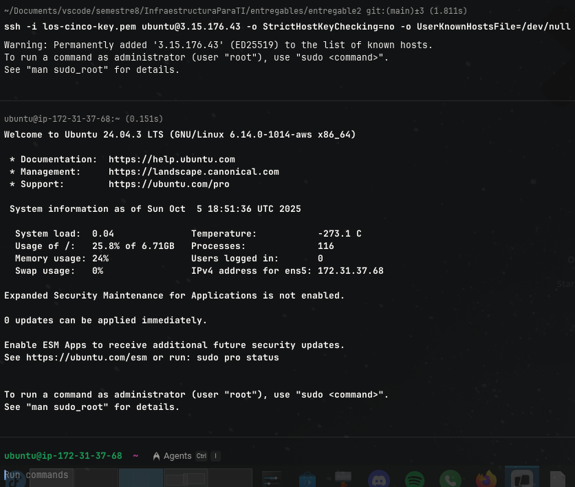

#### Install Docker

En base a la documentación de Docker, para instalar Docker en Ubuntu ([aquí](https://docs.docker.com/engine/install/ubuntu/)), se deben ejecutar los siguientes comandos:

```bash
# https://docs.docker.com/engine/install/ubuntu/#install-using-the-repository

# Add Docker's official GPG key:
sudo apt-get update
sudo apt-get install ca-certificates curl -y
sudo install -m 0755 -d /etc/apt/keyrings
sudo curl -fsSL https://download.docker.com/linux/ubuntu/gpg -o /etc/apt/keyrings/docker.asc
sudo chmod a+r /etc/apt/keyrings/docker.asc

# Add the repository to Apt sources:
echo \
  "deb [arch=$(dpkg --print-architecture) signed-by=/etc/apt/keyrings/docker.asc] https://download.docker.com/linux/ubuntu \
  $(. /etc/os-release && echo "${UBUNTU_CODENAME:-$VERSION_CODENAME}") stable" | \
  sudo tee /etc/apt/sources.list.d/docker.list > /dev/null
sudo apt-get update

# Install Docker Engine, containerd, and Docker Compose.
sudo apt-get install docker-ce docker-ce-cli containerd.io docker-buildx-plugin docker-compose-plugin -y
```

Y así se ve cuando se instala en la máquina virtual:
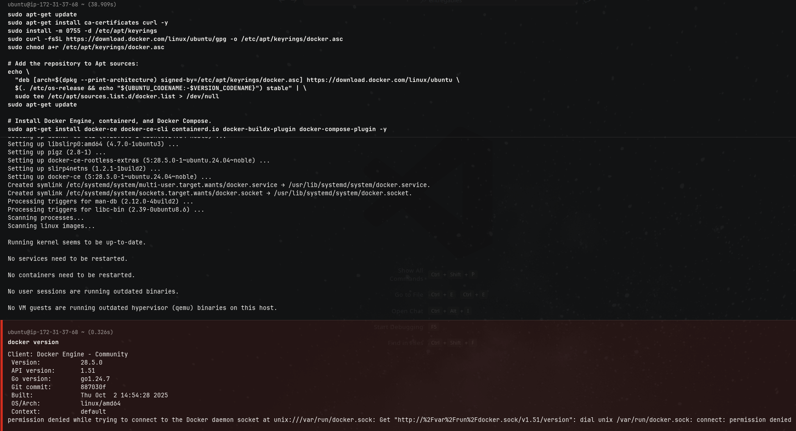

Sin embargo, cuando se instala Docker, es recomendable hacer unos pasos más, pues si se deja como está, para ejecutar contenedores de Docker es necesario tener los permisos de root; además, cuando se instala Docker, este no se abre cuando se prende el equipo por defecto. Entonces, como pasos de postinstalación, se buscan cambiar estos comportamientos ([ver aquí](https://docs.docker.com/engine/install/linux-postinstall/)).

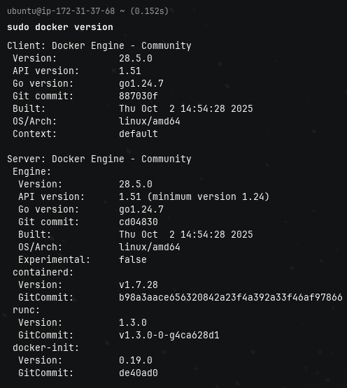

En nuestro caso, únicamente haremos que Docker sea posible ejecutarlo como usuario no root ([ver aquí](https://docs.docker.com/engine/install/linux-postinstall/#manage-docker-as-a-non-root-user)). Para ello, se ejecutan los siguientes comandos:

```bash
sudo groupadd docker
sudo usermod -aG docker $USER
```

Y reiniciar la máquina virtual, se puede utilizar el siguiente comando si se desea:

```bash
# sudo systemctl reboot
sudo shutdown -r now
```

¿Por qué reiniciar la máquina virtual? Por lo que se ve en la siguiente imagen:
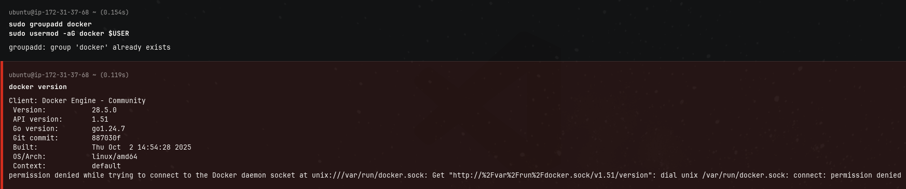

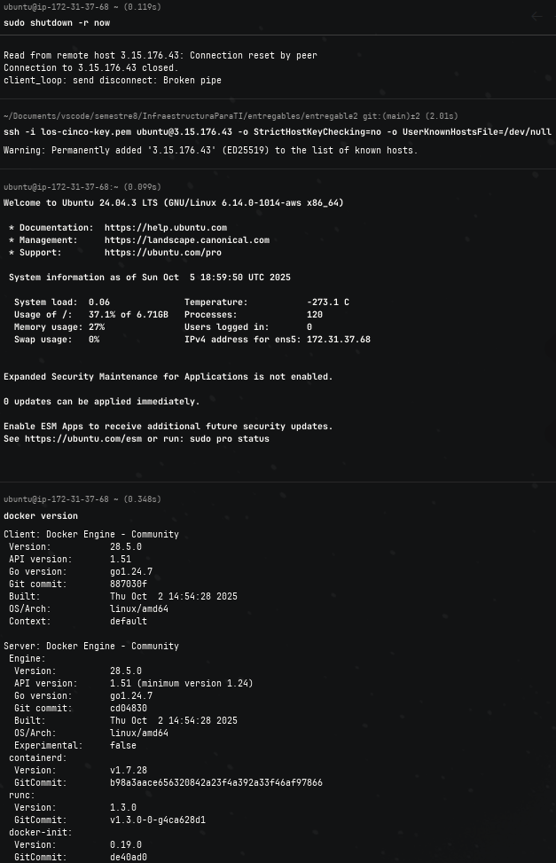

### Docker run hello-world

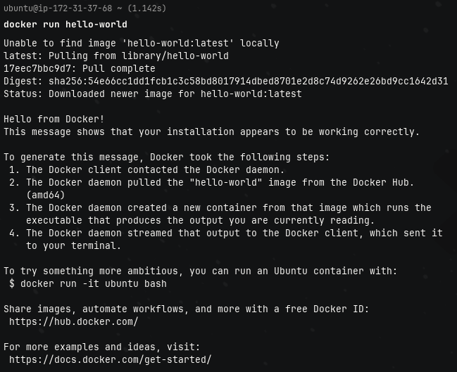

### Deploy Web Application

#### Install .NET 8 SDK

```bash
sudo apt-get update && sudo apt-get install -y dotnet-sdk-8.0
```

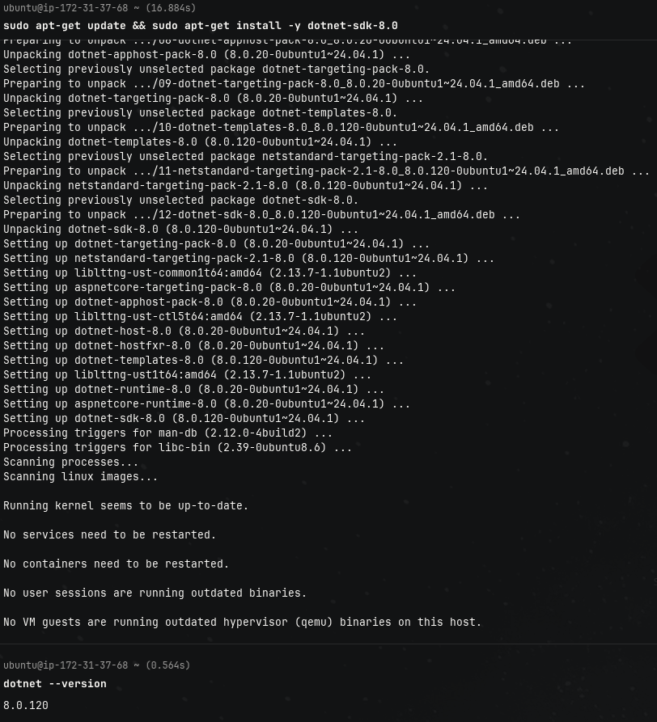

#### Create web app

Crear la aplicación web con .NET de la siguiente forma:

```bash
dotnet new web -n LosCincoWebApp
```

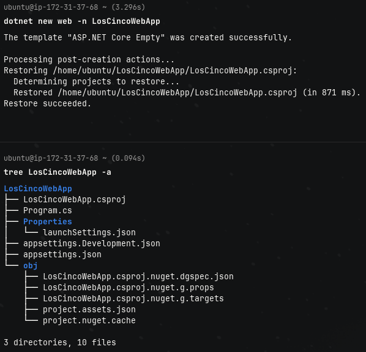

#### Dockerfile

Este es el Dockerfile

```Dockerfile
FROM mcr.microsoft.com/dotnet/sdk:8.0 AS build
WORKDIR /app

# Copy everything
COPY . ./

# Restore as distinct layers
RUN dotnet restore

# Build and publish a release
RUN dotnet publish -o out

# Build runtime image
FROM mcr.microsoft.com/dotnet/aspnet:8.0 AS runner
WORKDIR /app

COPY --from=build /app/out .
ENTRYPOINT ["dotnet", "LosCincoWebApp.dll"]
```

Este Dockerfile se debe pegar en la máquina virtual en el directorio donde se creó el proyecto con .NET, ya sea utilizando Vim, Nano, etc. Con este comando es otra posible opción:

```bash
cd LosCincoWebApp

echo -e "FROM mcr.microsoft.com/dotnet/sdk:8.0 AS build
WORKDIR /app

# Copy everything
COPY . ./

# Restore as distinct layers
RUN dotnet restore

# Build and publish a release
RUN dotnet publish -o out

# Build runtime image
FROM mcr.microsoft.com/dotnet/aspnet:8.0 AS runner
WORKDIR /app

COPY --from=build /app/out .
ENTRYPOINT [\"dotnet\", \"LosCincoWebApp.dll\"]
" > Dockerfile
```

#### Build and Run

Y ya es posible ejecutar los siguientes comandos de Docker para crear la imagen con el Dockerfile, y luego correr un contenedor con la imagen antes creada:

```bash
docker build . -t loscinco-dotnet-app:latest
docker run -d -p 80:8080 --name LosCincoDotnetApp loscinco-dotnet-app:latest
```

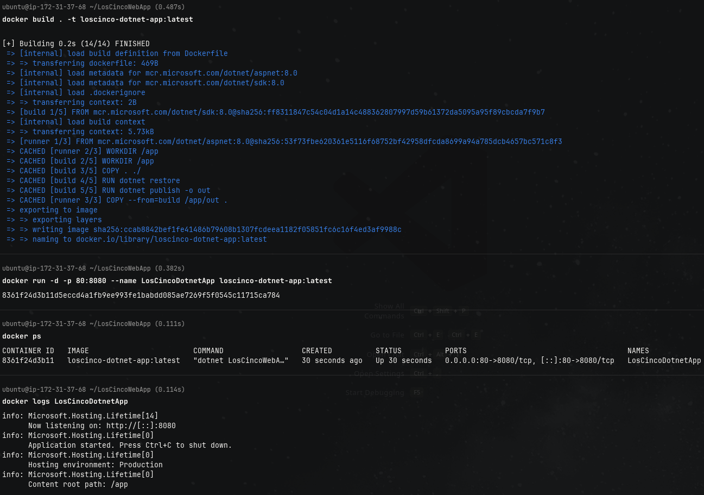

La opción `-t loscinco-dotnet-app:latest` en `docker build` sirve para asignarle una etiqueta a la imagen que se crea a partir del Dockerfile, dicha etiqueta tiene el formato: `<IMAGE-NAME>[:<VERSION=latest>]`, en este caso, el nombre de la imagen es loscinco-dotnet-app, y la versión es la última (`latest`), si esta no se especifica, por defecto se toma como `latest`.

Las opciones `-d`, `-p 80:8080` y `--name LosCincoDotnetApp` sirven para lo siguiente:

* `-d`. Sirve para ejecutar el contenedor en segundo plano, si este no es especifica, la termina se bloquea hasta que el contenedor finalice.

* `--name LosCincoDotnetApp`. Cuando se ejecuta un contenedor y no le especifica un nombre al contenedor, Docker automaticamente le asigna uno, de esta manera se le está asignando un nombre que puede servir de identificador luego, cuando se quieran ejecutar varios contenedores utilizando la misma imagen. Los nombres de los contenedores son únicos.

* `-p 80:8080`. La aplicación cuando se ejecuta abre el puerto 8080 para recibir solicitudes HTTP. Sin embargo, para que el servidor reciba estas solicitudes por este puerto, la red que se utiliza es la de Docker, la cual no es necesariamente siempre la misma del equipo host. Es decir, todos los equipos tienen una dirección IP que representa a la misma computadora (`localhost`, normalmente `127.0.0.1`), pero en este caso, la red de Docker es `172.17.0.0/16` (`172.17.0.1` es el gateway), entonces, ¿cómo sé la dirección IP de mi contenedor? Con el comando `docker network inspect bridge`, lo que retorna un JSON.

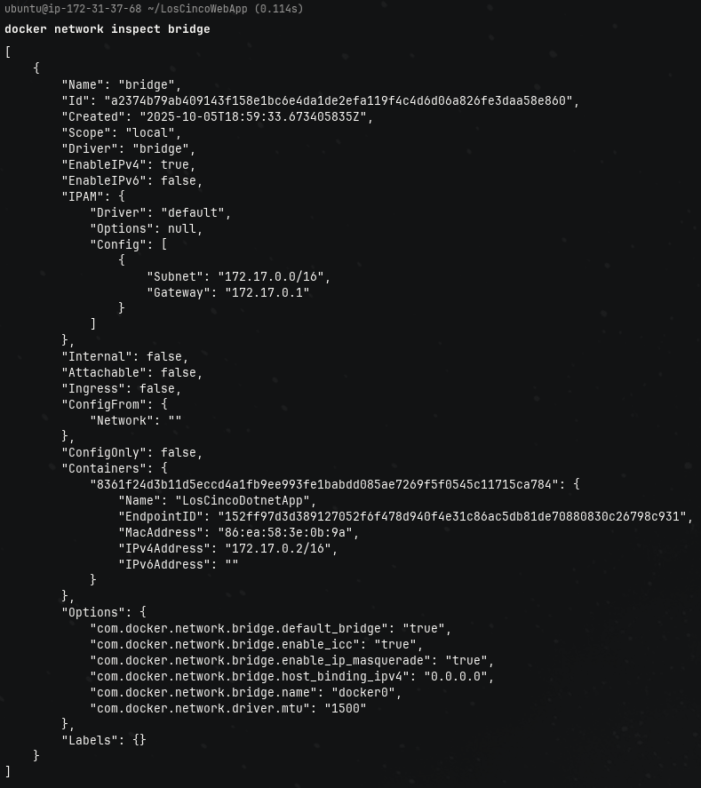

Con la dirección IP del contenedor ya es posible realizar las solicitudes directamente a una IP y un puerto, sin embargo, esto puede ser poco practico, por lo que, muchas veces lo que se opta por hacer es publicar el puerto (de ahí el `--publish` o `-p`), para redirigir el tráfico desde el equipo host, hasta el puerto del contenedor que se va a ejecutar. La sintaxis es la siguiente: `[-p/--publish] <HOST_PORT>:<CONTAINER_PORT>`, en nuestro caso, se está redirigiendo el tráfico desde el puerto 80 del equipo host, hasta el 8080 del contenedor.

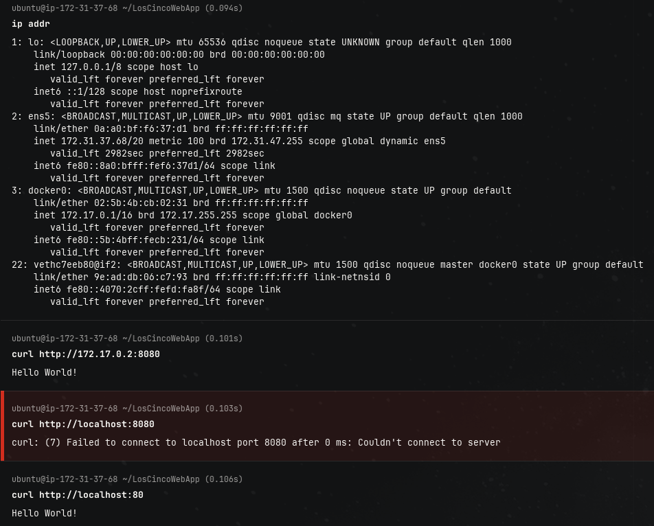

Comandos como `docker ps` o `docker logs`, sirven para comprobar si el contenedor realmente esté corriendo, y con los logs es posible ver con más detalle lo que está pasando dentro del contenedor, es posible que el contenedor falle y no corra, y con los logs se pueda saber cuál es la causa, o que sí esté corriendo, pero no esté funcionando como se esperaría, también es de bastante utilidad ver los logs. En este caso, el contenedor sí está corriendo y funcionando como se esperaría.

#### Publish Image

Con Docker tambien es posible guardar y compartir imagenes propias a todo el internet, para ello existen diferentes registros de imagenes (ver más [aquí](https://docs.docker.com/get-started/docker-concepts/the-basics/what-is-a-registry/)), entre ellas la más conocida es Dockerhub.

Para publicar imagenes es necesario tener una cuenta de Dockerhub, y vincularla de manera local con el comando `docker login`, así como se ve en la imagen de abajo:
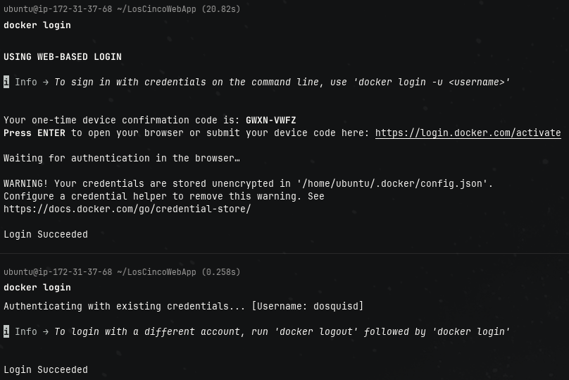

Cuando se haya iniciado sesión, es necesario tener una imagen donde la etiqueta siga el siguiente formato: `<USERNAME>/<DOCKER_IMAGE[:TAG]>`. `<USERNAME>` debe coincidir con el usuario que se haya logueado, y `DOCKER_IMAGE` es la etiqueta de la imagen que se subirá al Dockerhub. ¿Cómo se hace esto? Con `docker image tag SOURCE_IMAGE[:TAG] TARGET_IMAGE[:TAG]` se crea una etiqueta `TARGET_IMAGE` que se hace referencia a `SOURCE_IMAGE` (más información [aquí](https://docs.docker.com/reference/cli/docker/image/tag/)), entonces no se está creando una imagen completamente desde 0, sino que se está tomando una ya existente en local, para hacerle una "copia". Se ha de mencionar que, `docker tag` es lo mismo a `docker image tag`.

Luego de obtener la anterior imagen, se debe utilizar `docker image push NAME[:TAG]` que sube la imagen a Dockerhub (más información [aquí](https://docs.docker.com/reference/cli/docker/image/push/)). Al igual que `docker tag` es lo mismo a `docker image tag`, `docker push` es equivalente a `docker image push`.

Así se hizo en nuestro caso:
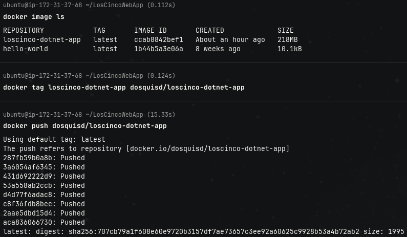

Y la image se encuentra ahora mismo disponible en: [https://hub.docker.com/repository/docker/dosquisd/loscinco-dotnet-app/general](https://hub.docker.com/repository/docker/dosquisd/loscinco-dotnet-app/general).
